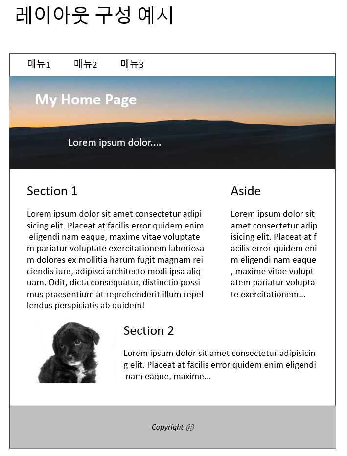
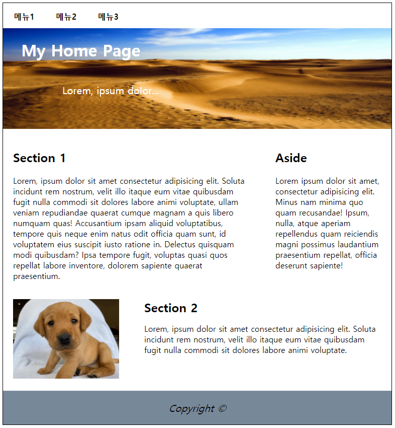

# 1. 과제 주제 설명
강의를 통해 배우게 된 <br>
박스 모델 속성, 레이아웃 속성, Flex와 Grid 기능을 사용하여 <br>
다음과 같은 웹페이지의 레이아웃을 만드는 과제 입니다.

<a href="#"></a> 

<br>

# 2. 주요 코드 설명

1. **Grid 기능을 통해 전체적인 레이아웃 생성.**
    - grid-template-rows와 grid-template-columns 기능을 사용하여 5 X 3 의 그리드 생성.
        - ```html grid-template-rows : repeat(5, auto);```
        - ```html grid-template-columns : repeat(3, 1fr);```
    
    - grid-template-areas 기능을 사용하여 각 영역의 이름을 지정.
        - Header
        - Main
        - Section, Aside
        - Sidebar, Content
        - Footer
    
    - grid-column 기능을 사용하여 각 영역의 범위를 지정.
        - ```html grid-column: span ```
        - ```html grid-column: span 3 ```
        - Row의 경우 유동적인 크기 조정을 위하여 <br>
        ```html grid-template-rows : repeat(5, auto);``` 로 설정.
    
    - justify-self 기능을 사용하여 각각의 단일 grid item을 수평 축 기준으로 정렬.
        - ```html justify-self: center;```
        - ```html justify-self: end;```

<br>

2. **Flex Box 기능을 통해 Header 박스의 요소 배치.**
    - justify-content기능을 통해 메뉴 1, 2, 3 분산 배치.
    - ```html justify-content: space-around;```

<br>

3. **박스 모델 속성을 통해 세부적인 크기와 위치 지정.**
    - padding
    - margin
    - width
    - height
    - text-align
    - 등의 박스 모델 속성 사용.

<br>

# 3. 비고 및 고찰

1. **Flex 박스 속성과 Grid 기능의 응용 및 적용법을 익힐 수 있는 계기가 되다.**<br><br>
Flex 박스 속성과 Grid 기능의 개념을 처음 접해본 수업이었습니다. <br>
비록 간단한 레이아웃이지만 그동안의 배운 개념을 이리저리 접목하면서 <br>
레이아웃이 점점 구성을 갖춰가는 진행상황을 과제 수행 기간 내내 생생하게 느낄 수 있었습니다. 
<br><br>

2. **프로그래밍은 결코 가벼운 것이 아니다.**<br><br>
이번 과제를 통해 그동안 프로그래밍을 가볍게 생각하고 있었음을 깨닫고 생각을 고칠 수 있게 되었습니다. <br>
응용력과 창의력을 요구하는 이번 과제는 평소 비교적 간단한 코딩만을 연습하던 저에게 큰 일격을 날렸습니다. <br>
이번 과제를 통해 더욱 고차원적이고 깊은 단계의 연습이 필요하다는 사실을 알게 되었습니다.
<br><br>

3. **프로그래밍은 인내심이 필요하다.**<br><br>
거의 처음해보다시피 하는 이번 응용 과제를 수행하는 과정에서 저는 확실히 많은 시간을 투자하였고 동시에 많은 스트레스도 받았습니다. <br>
되돌아보니 저는 이번 과제 수행기간 내내 조바심에 사로잡혀있었습니다. <br>
아직 미숙한 단계임에도 빠른 시간내에 결과물을 내려 하니 제대로 된 사고가 힘들었습니다. <br>
분명 훗날에는 빠른 속도를 갖춘 개발자로 발전해야겠지만, 연습단계인 지금의 저는 속도 보다는 <br>
정확성과 응용력에 초점을 맞춰야함을 깨닫게 되었습니다. <br>
아울러 제가 원하는 결과물이 시각적으로 바로 표현된다는 점에서 프론트엔드 코딩이 다시한번 <br>
매력적으로 느끼게 되는 계기가 되었습니다.
<br><br>

4. **미숙했던 부분**
    1. CSS 자손, 자식 선택자의 개념이 아직 미숙함을 깨달았습니다..
    2. width, height의 크기 값을 퍼센트(%)로 부여하는 연습이 더 필요함을 깨달았습니다.
    3. Flex와 Grid를 더욱 깊고 능숙하게 응용할 수 있도록 추가적인 연습이 필요함을 깨달았습니다.
    4. 단순히 이번 CSS 과정을 넘어 앞으로의 프로그래밍 공부에서 더욱 깊은 공부가 필요함을 깨달았습니다.

<br>

# 4. 결과물


<a href="#"></a> 