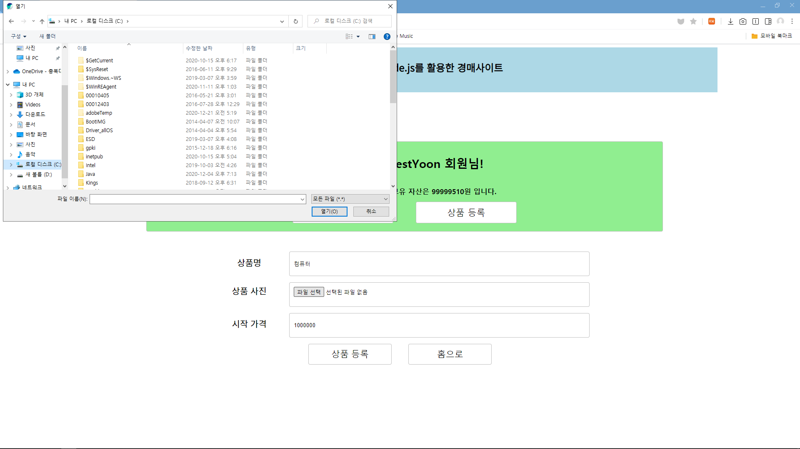
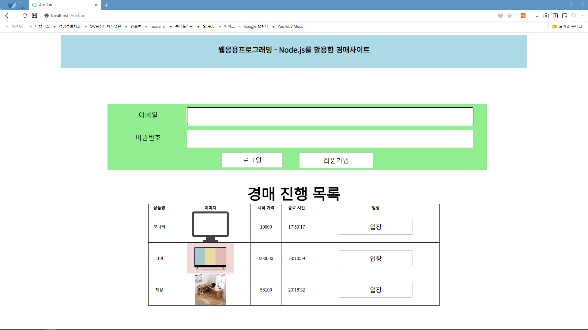

# 1. 과제 내용 설명
1 ~ 14주차 강의를 통해 배운 <br>
HTML, CSS, JavaScript, Node.js (Express), DB를 응용하여 <br>
풀스택 웹사이트를 제작하는 과제입니다. <br>

# 2. 주요 기능 설명
Node.js (Express)와 MySQL을 활용하여 <br>
실시간으로 경매가 이루어지는 웹사이트를 제작하였습니다.<br><br>
<a href="#"></a>

1. **HTML, CSS 활용하여 레이아웃 작성**
    - Flex, Grid 사용.
        - ```grid-template-rows: repeat(2, 1fr);```
        - ```grid-template-columns: repeat(3, 1fr);```
        - ```grid-template-areas: "header header header" "main main main";```
        - header와 main 섹션으로 레이아웃을 나누었으며, 그 밑에서부터 출력되는 내용은 라우팅에 따라 웹사이트가 이동할 때, CSS가 깨지는 현상이 발생하여 부득이하게 Grid에 포함시키지 않았습니다.
    <br>
    - 경매 상품 표시 기능.
        - table 속성을 통해 경매 진행 목록을 표시하였습니다.
        - 표시되는 내용은 상품명, 이미지, 시작가격, 종료시간, 해당 방으로 입장 버튼 입니다. <br>
        <a href="#"></a>
    <br>
    - views 파일 작성.
        - views 폴더에 layout.html, main.html, join.html, good.html, aunction.html 을 작성하였습니다.
        - layout.html : 전체적인 레이아웃.
        - main.html : 경매 목록이 포함되어있는 메인 화면
        - join.html : 회원가입 Form.
        - good.html : 경매 상품 업로드 화면. (이미지 업로드 폼 포함)
        - auction.html : 실시간 경매가 이루어지는 화면.
        - public/index.css 작성.
    <br>
2. **JavaScript 활용하여 기능 추가.**
    - window.onload 함수를 사용하여 각 페이지에서 에러 메시지가 발생하도록 구축했습니다. (loginError, joinError 등등)
    <br>
3. **Node.js, MySQL 활용하여 핵심 기능 추가**
    - **```npm i```를 통해 필요한 패키지 설치.**
        - cookie-parserm, dotenv, express, express-session, morgan, multer, nunjucks, bcrypt, node-schedule, passport, passport-local, socket.it, sse를 설치하였습니다.
        - MySQL 사용을 위해 sequelize, sequelize-cli, mysql2 패키지를 설치하였고,
        ```npx sequelize init```으로 기본 Directory를 생성하였습니다.<br>
    <a href="#"></a>
        - config.json에 MySQL 데이터베이스 설정을 작성하였습니다.
    <br>
    - **모델 작성.**
        - Routing을 위해 models폴더에 user.js, good.js, auctions.js 를 작성하였습니다.
        - user.js : 사용자 이메일, 닉네임, 비밀번호와 자금.
        - good.js : 상품의 이름, 사진, 입찰 시작 가격.
        - auction.js : 입찰가 (bid)와 입찰 시 전달할 메시지.
    <br>
    - **DB 생성 및 관계 설정.**
        - npx sequelize db:create를 통해 auction이라는 이름의 DB를 생성하였습니다.
        - models/index.js에 다음과 같은 내용을 추가하였습니다.
        - 한 사용자는 여러 상품을 등록할 수 있습니다. (user-good, as: owner)
        - 한 사용자는 여러 상품을 낙찰할 수 있습니다.(user-good, as: sold)
        - 한 사용자는 횟수의 제한 없이 경매에 입찰할 수 있습니다.(user-auction)
        - 한 상품에 대해 여러 사용자가 경매 입찰할 수 있습니다. (good-auction)
        - as는 OwnerId, SoldId로써 상품 모델에 Column이 추가됩니다.
    <br>
    - **Passport 세팅.**
        - 로그인 기능을 구현하기 위해 routes/auth.js, routes/middlewares.js를 작성하여 미들웨어의 기능을 하도록 했습니다.
        - Passport 패키지를 통해 email과 password로 로그인 할 수 있으며, 비밀번호가 일치하지 않거나 가입되지 않은 회원일 경우 로그인이 불가능합니다.
        - 또한 bcrypt 패키지를 통해 각 회원의 비밀번호는 암호화되어 저장됩니다.
        <br><br>
        <a href="#"></a>
        <br><br>
    - **.env 작성.**
        - .env 파일에서 COOKIE_SECRET 을 통해 쿠키 비밀키를 입력했습니다.
    <br>
    - **app.js 작성.**
        - app.js를 작성하여 메인 구조와 서버 연동 구조를 구축하였습니다.
        - port는 기본 3050으로 설정하였으며 process.env.PORT 를 통해 추후 호스팅할 경우 호스팅의 PORT를 받아오도록 설정하였습니다.
        - sequelize.sync를 통해 MySQL 데이터베이스와 연동하였습니다.
        - cookie가 갖고있는 보안적인 한계를 보완하기 위해 session을 사용하여 데이터를 서버에 저장하도록 하였습니다.
        - error 설정을 통해 해당하는 Router가 없을경우 등에 표시될 에러메시지를 장성하였습니다.
    <br>
    - **Routing 구축.**
        - routes/index.js를 작성하여 Router를 작성하였습니다.
        - GET / : 메인 페이지 렌더.
            - 경매가 진행 중인 상품 모두를 화면에 렌더링하는 라우터를 작성했습니다. (SoldId: null을 통해 낙찰되지 않은 상품들만 표시했습니다.)
        - GET /join : 회원가입 페이지 라우터.
        - GET /good : 상품 등록 페이지 라우터.
        - POST /good : 상품 등록 라우터.
            - 상품 이미지 업로드를 위해 multer 패키지를 사용하였습니다.
            - 이미지는 5 * 1024 * 1024로 제한되어 업로드됩니다.
        <br><br>
        <a href="#"></a>
        <br><br>
        - GET /good/:id : 해당 상품과 기존 입찰 정보들을 불러온 뒤 렌더링합니다.
        - POST /good/:id/bid : 클라이언트로부터 받은 입찰 정보를 저장합니다. 추후 기술할 여러가지 제한이 여기서 이루어집니다.
        - ```req.user```을 통해 로그인 했을 때 user에 회원정보를 입력하는 라우터를 작성했습니다.
        - 상품 등록자의 정보를 표시하는 라우터를 작성했습니다.
        - 입찰 화면으로 이동하는 라우터를 작성했습니다.
            - Promise.all을 통해 상품과 입찰자를 변수에 저장하였고,
            - findOne을 통해 경매 상품을 찾아 매칭하였습니다.
        - 상품 존재 여부를 체크하는 라우터를 작성했습니다.
        - 여러가지 제한을 부여하는 라우터를 작성했습니다.
            - 입찰 가격은 시작 가격보다 높아야합니다.
        <br><br>
        <a href="#"></a>
        <br><br>
            - 경매는 24시간동안 진행됩니다.
            - 직전의 입찰보다 더 높은 금액의 입찰가를 제시해야합니다.
        <br><br>    
        <a href="#"></a>
        <br><br>
            - 모든 입찰 과정이 끝나면 경매 내역은 저장됩니다.
        <br>
    - **서버센트 이벤트 사용**
        - 모든 접속자에게 같은 시간이 표시되어야하므로 서버 시간을 표시할 수 있는 서버센트 이벤트를 적용하였습니다.
        - SSE 패키지를 사용하였으며, 웹 소켓 패키지를 통해 실시간 입찰 기능을 구현하였습니다.
        - app.js 에서 sse, webSocket 변수로 해당 패키지를 불러왔으며, server 변수에 app.listen 이벤트를 구현하여 PORT 정보를 출력하고, 현재 해당 포트에 연결 중임을 나타내도록 하였습니다.
        - sse.js를 작성하여 서버와 연결되었을 때 호출되는 이벤트를 sse.on('connection')로 작성하였습니다. client.send를 통해 클라이은트는 서버 시간을 볼 수 있게 됩니다.
    <br>
    - **웹 소켓 구현**
        - socket.io를 통하여 서버와 브라우저 간 연결을 유지한 상태로 데이터를 교환할 수 있도록 하였습니다.
        - io.on('connection')를 통해 웹 소켓 연결 시 발생 이벤트를 설정하였습니다.
        - socket.join(roomId) : 경매방에 참가하는 소켓입니다.
            - roomId는 good(상품) 테이블의 Raw id 입니다.
        - socket.on('disconnect') : 경배방에서 퇴장했을 때의 소켓입니다.
    <br><br>
    <a href="#"></a>
    <br>
# 3. 결과
전체 페이지 캡처입니다.
<br><br>
<a href="#"></a><br><br>
<a href="#"></a><br><br>
<a href="#"></a><br><br>
<a href="#"></a><br><br>
<a href="#"></a><br><br>
